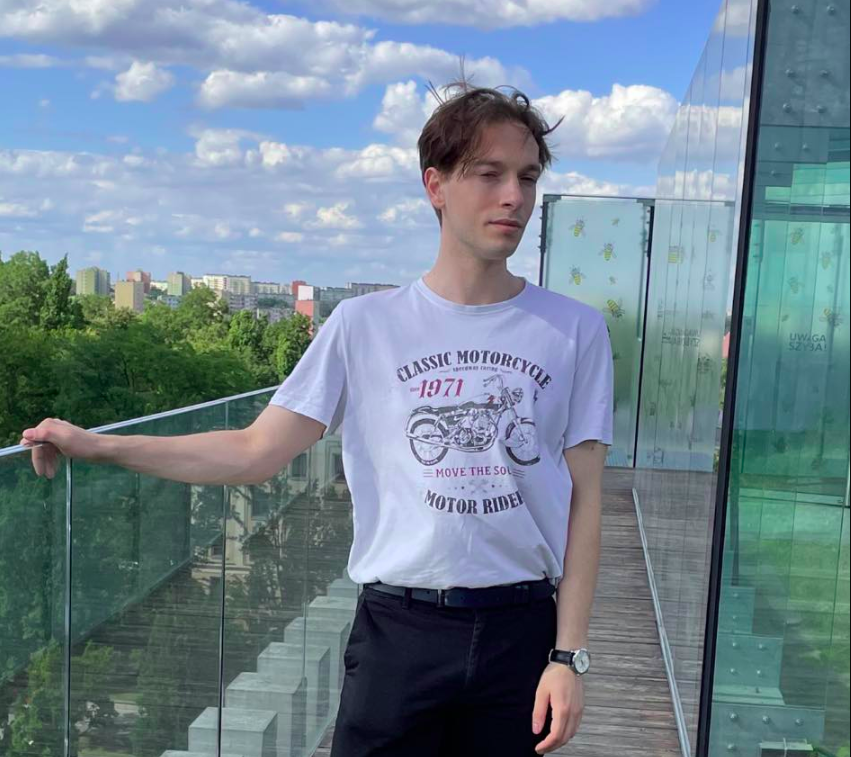

Hi, My name's Robert.

I'm a math and computer science student at the University of Wroclaw. I'm interested in machine learning, databases, applied math, and system programming. In my free time, I enjoy playing sports, digging into open-source projects, learning about history, and watching movies with my girlfriend. On this website, I'll be sharing updates on what I'm working on, the books I've read, and sometimes share my thoughts on various subjects.

You can find me on:

[Github](https://github.com/robert72127)

[Linkedin](https://www.linkedin.com/in/rorlikowski/)
